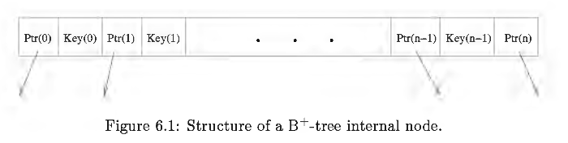

# BTree Module
This page explains the implementation of BTree module and compare the differences
of it and related modules to the SQLite implementation.


Important
- Rust-sqlite does not use the VM Layer that SQLite has.


Sources
- Subsankar Haldar, SQLite Database System Design and Implementation


## This implementation
- should BtCursor return, traverse at page or page's cell level?

Mapping equivalent components this implementation -> SQLite:
- Database -> sqlite3 *db // the database connection
- BufferPool -> Pager
- Page -> MemPage
- do we need BtShared?
- BtCursor -> BtCursor
- ExecScan -> VM full scan func


## What SQLite does

What is its client/ caller?
- VM module in SQLite ~= Physical Execution module in this repo.


Requirements for this module
- provide API to `cluster and organize tuples (entry)` of a relation and separate them from those of other relations.
- provide API to `store, retrieve, manipulate tuples` efficiently.
- do the `translation of tuples to pages`.


Control data structures
- 1 Btree --> 1 db file (not a single B- or B+ tree)
- 1 BtreeCursor --> a specific tree identified by its root page (a table, index, etc.)
  - a cursor has to be either a read or write, not both.
  - can be many open cursors on same tree, each created by calling `fn sqlite3BtreeCursor`


### Btree Module interfaces
1. sqlite3BtreeOpen
2. sqlite3BtreeClose
3. sqlite3BtreeCursor opens cursor to a specfic tree in db file (table, index, etc.).
4. sqlite3BtreeCloseCursor
5. sqlite3BtreeClearCursor
6. `sqlite3BtreeFirst` 
-- fn acts on cursor, moves cursor to first element of tree (left most node).
7. sqlite3BtreeLast
8. sqlite3BtreeNext
9. `sqlite3BtreePrevious` 
-- moves cursor to previous element.
10. sqlite3BtreeMoveToUnpacked 
-- moves cursor to element that matches key value passed as argument. if no exact match, cursor points to leaf page would hold the entry (to an entry that comes before or after the key).
11. sqlite3BtreeBeginTrans
12. sqlite3BtreeCommitPhaseOne
13. sqlite3BtreeCommitPhaseTwo
14. sqlite3BtreeDelete
15. sqlite3BtreeInsert
16. `sqlite3BtreeKeySize`
-- fn acts on cursor, returns number of bytes of key cursor pointing to, 0 if pointing to no valid entry.
17. sqlite3BtreeKey
18. sqlite3BtreeDataSize
19. sqlite3BtreeData
20. sqlite3BtreeGetMeta returns db metadata.


### B+-tree Structure

- B+ tree is a variant of B-tree, all entries in leaf nodes.
- An entry = (key value, data value) pair
- entries are sorted by `key value`
- internal nodes contain only search info (key values) and child pointers. `P(0) <= Key(0) < P(1) <= Key(1) < ...`
  - All keys on the left most child subtree that Ptr(0) points to have values less than or equal to Key(0);
  - All keys on the child subtree Ptr(l) points to have values greater than Key(0) and less than or equal to Key(1), and so forth;
  - All keys on right most child subtree that Ptr(n) points to have values greater than Key(n- 1).





### Btree struct: a Btree handle
- How does Btree, BtCursor, sqlite3BtreeCursor connection to Table?
  - There is not a direct link.
  - Btree and BtCursor operate at lower level, dealing with B-Tree structures.
  - Table structure is used at a higher level to represent schema of a table.
  - When a table is accessed as part of a SQL statement, SQLite will use the information 
  in the Table structure to determine how to access the table. This may involve calling 
  `sqlite3BtreeCursor` to open a cursor on the table's B-Tree structure, 
  but this is done indirectly, not directly from the `Table` structure.


``` 
/* A database connection contains a pointer to an instance of
** this object for every database file that it has open.  This structure
** is opaque to the database connection.  The database connection cannot
** see the internals of this structure and only deals with pointers to
** this structure.
**
** VM opens a db file -> BTree object. VM uses obj as handle to modify the file.
** it summarizes everything VM needs to know about the file. 
** BTree obj == db connection for for VM.
*/
struct Btree {
  sqlite3 *db;       /* The database connection holding this btree */
  BtShared *pBt;     /* Sharable content of this btree */
  u8 inTrans;        /* TRANS_NONE, TRANS_READ or TRANS_WRITE */
  u8 sharable;       /* True if we can share pBt with another db */
  u8 locked;         /* True if db currently has pBt locked */
  u8 hasIncrblobCur; /* True if there are one or more Incrblob cursors */
  int wantToLock;    /* Number of nested calls to sqlite3BtreeEnter() */
  int nBackup;       /* Number of backup operations reading this btree */
  u32 iBDataVersion; /* Combines with pBt->pPager->iDataVersion */
  Btree *pNext;      /* List of other sharable Btrees from the same db */
  Btree *pPrev;      /* Back pointer of the same list */
#ifdef SQLITE_DEBUG
  u64 nSeek;         /* Calls to sqlite3BtreeMovetoUnpacked() */
#endif
#ifndef SQLITE_OMIT_SHARED_CACHE
  BtLock lock;       /* Object used to lock page 1 */
#endif
};
```


### BtShared struct
```   
// represents state of a single db file
struct BtShared
    pPager // ptr to a Pager that manages this db and journal file
    pCursor // a list of open cursors on trees of db
    pageSize // total number of bytes on each page
    nTransaction // number of open (read and write) transactions
    inTransaction // transactional state
    pSchema // ptr to schema cache of schema objects
    db // ptr to lib connection that currently using this object
    pPage1 // pointer to in-mem copy of MemPage object for db Page 1
    mutex // access synchronizer
    // ,,, other control vars
    

struct MemPage
    pBt // pointer to BtShared obj to which this page belongs to.
    pDbPage // pointer to page header PgHdr that holds this page.
    pgno // page number for this page.
    aData // pointer back to the start of the in-cache page image.
    intKey // for B+tree
    leaf // true if leaf flag is set
    hasData // true if this page stores data
    nCell
    nFree
    // ... other vars
```


### BtCursor
```
// Cursor acts as a logical pointer to particular entry in a tree.
// For each open tree, tree module creates an object of BtCursor type 
// that is used as a handle to read, insert, or delete tuples from the tree.
struct BtCursor {
  u8 eState;                /* One of the CURSOR_XXX constants (see below) */
  u8 curFlags;              /* zero or more BTCF_* flags defined below */
  u8 curPagerFlags;         /* Flags to send to sqlite3PagerGet() */
  u8 hints;                 /* As configured by CursorSetHints() */
  int skipNext;    /* Prev() is noop if negative. Next() is noop if positive.
                   ** Error code if eState==CURSOR_FAULT */
  Btree *pBtree;            /* The Btree to which this cursor belongs */
  Pgno *aOverflow;          /* Cache of overflow page locations */
  void *pKey;               /* Saved key that was cursor last known position */
  /* All fields above are zeroed when the cursor is allocated.  See
  ** sqlite3BtreeCursorZero().  Fields that follow must be manually
  ** initialized. */
#define BTCURSOR_FIRST_UNINIT pBt   /* Name of first uninitialized field */
  BtShared *pBt;            /* The BtShared this cursor points to */
  BtCursor *pNext;          /* Forms a linked list of all cursors */
  CellInfo info;            /* A parse of the cell we are pointing at */
  i64 nKey;                 /* Size of pKey, or last integer key */
  Pgno pgnoRoot;            /* The root page of this tree */
  i8 iPage;                 /* Index of current page in apPage */
  u8 curIntKey;             /* Value of apPage[0]->intKey */
  u16 ix;                   /* Current index for apPage[iPage] */
  u16 aiIdx[BTCURSOR_MAX_DEPTH-1];     /* Current index in apPage[i] */
  struct KeyInfo *pKeyInfo;            /* Arg passed to comparison function */
  MemPage *pPage;                        /* Current page */
  MemPage *apPage[BTCURSOR_MAX_DEPTH-1]; /* Stack of parents of current page */
};
```


### How is a table scan executed?

Step 1: BtCursor is open on a Btree with `int sqlite3BtreeCursor(...)`.
This cursor is used to traverse rows in a table or entries in an index.
```
int sqlite3BtreeCursor(
  Btree *p,                                   /* The btree containing the table to open */
  Pgno iTable,                                /* Root page of table to open */
  int wrFlag,                                 /* 1 to write. 0 read-only */
  struct KeyInfo *pKeyInfo,                   /* First arg to xCompare() */
  BtCursor *pCur                              /* Allocated space to write new cursor here */
){
  if( p->sharable ){
    return btreeCursorWithLock(p, iTable, wrFlag, pKeyInfo, pCur);
  }else{
    return btreeCursor(p, iTable, wrFlag, pKeyInfo, pCur);
  }
}
```

Step 2: Moving to the first row
- The cursor is moved to the first row in the table using the `sqlite3BtreeFirst()` function.

``` 
/* Move the cursor to the first entry in the table.  Return SQLITE_OK
** on success.  Set *pRes to 0 if the cursor actually points to something
** or set *pRes to 1 if the table is empty.
*/
int sqlite3BtreeFirst(BtCursor *pCur, int *pRes){
  int rc; // return code

  assert( cursorOwnsBtShared(pCur) );
  assert( sqlite3_mutex_held(pCur->pBtree->db->mutex) );
  rc = moveToRoot(pCur);
  if( rc==SQLITE_OK ){
    assert( pCur->pPage->nCell>0 );
    *pRes = 0;
    rc = moveToLeftmost(pCur);
  }else if( rc==SQLITE_EMPTY ){
    assert( pCur->pgnoRoot==0 || (pCur->pPage!=0 && pCur->pPage->nCell==0) );
    *pRes = 1;
    rc = SQLITE_OK;
  }
  return rc;
}

/*
** Move the cursor down to the left-most leaf entry beneath the
** entry to which it is currently pointing.
**
** The left-most leaf is the one with the smallest key - the first
** in ascending order.
*/
static int moveToLeftmost(BtCursor *pCur){
  // why static? static = internal linkage = can only be called within same file, not from other files.
  Pgno pgno;
  int rc = SQLITE_OK;
  MemPage *pPage;

  assert( cursorOwnsBtShared(pCur) );
  assert( pCur->eState==CURSOR_VALID );
  
  // Traversing down the B-Tree, moving the cursor to the leftmost child of each page, until it reaches a leaf page.
  // continue as long as the previous operation was successful (rc == SQLITE_OK) 
  // and the current page is not a leaf page. 
  while( rc==SQLITE_OK && !(pPage = pCur->pPage)->leaf ){
    // check if the current cell index (pCur->ix) is less than the total number of cells 
    // in the page (pPage->nCell) to ensure that the cursor is within the bounds of the page.
    assert( pCur->ix < pPage->nCell );
    // get page number of child page that cursor should move to next
    pgno = get4byte(findCell(pPage, pCur->ix));
    // move cursor to the child page
    rc = moveToChild(pCur, pgno);
  }
  return rc;
}
```

Step 3: Iterating over the rows
- The rows in the table are iterated over using a loop. 
- Inside the loop, the sqlite3BtreeNext() function is used to move the cursor to the next row.


```
int sqlite3BtreeNext(BtCursor *pCur, int flags){
  MemPage *pPage;
  UNUSED_PARAMETER( flags );  /* Used in COMDB2 but not native SQLite */
  assert( cursorOwnsBtShared(pCur) );
  assert( flags==0 || flags==1 );
  pCur->info.nSize = 0;
  pCur->curFlags &= ~(BTCF_ValidNKey|BTCF_ValidOvfl);
  if( pCur->eState!=CURSOR_VALID ) return btreeNext(pCur);
  
  pPage = pCur->pPage; // get the page that cursor is pointing to
  if( (++pCur->ix)>=pPage->nCell ){
    pCur->ix--;
    return btreeNext(pCur);
  }
  
  // if the current page is a leaf page, returns SQLITE_OK to indicate 
  // that the cursor has been successfully moved to the next entry
  if( pPage->leaf ){
    return SQLITE_OK;
  }else{
    // to move the cursor to the leftmost entry in the next level of the B-Tree.
    return moveToLeftmost(pCur);
  }
}

/*
** Move the cursor down to the left-most leaf entry beneath the
** entry to which it is currently pointing.
**
** The left-most leaf is the one with the smallest key - the first
** in ascending order.
*/
static int moveToLeftmost(BtCursor *pCur){
  Pgno pgno;
  int rc = SQLITE_OK;
  MemPage *pPage;

  assert( cursorOwnsBtShared(pCur) );
  assert( pCur->eState==CURSOR_VALID );
  while( rc==SQLITE_OK && !(pPage = pCur->pPage)->leaf ){
    assert( pCur->ix<pPage->nCell );
    pgno = get4byte(findCell(pPage, pCur->ix));
    rc = moveToChild(pCur, pgno);
  }
  return rc;
}
```


Step 4: Processing each row


Step 5: Closing the cursor

## References
- [SQLite doc -> Database File Format -> B-tree Pages](https://sqlite.org/fileformat.html#b_tree_pages)
- https://jvns.ca/blog/2014/10/02/how-does-sqlite-work-part-2-btrees/
- [Part 7 - Introduction to the B-Tree (Let's Build a Simple Database)](https://cstack.github.io/db_tutorial/parts/part7.html)