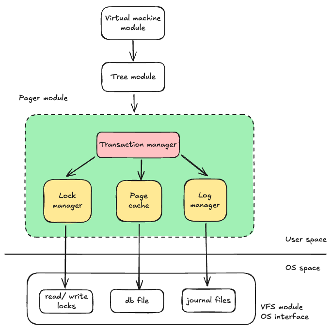
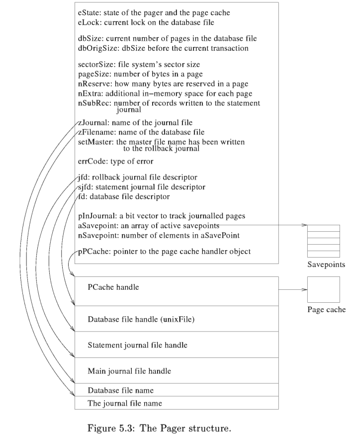

# Pager

Contents
1. Summary
2. Pager interface
3. Page cache
4. Transaction management

## Summary

Pager
- also called `Access module` in DBMS literature.
- is `mediator` btw native file system and higher modules (tree, virtual machine, etc.)
- main purpose: make db pages addressable in main memory.
- creates abstraction as entire db file available in memory as array of pages.
- implements ACID by controlling these resources directly; other modules need to go through Pager for them
  - db file access
  - controlling journal files access
  - managing locks
  
Page cache
- uses small heap space to store parts of db file.
- space is slotted, each slot holds `1 db page` + some control info.
- caching scheme is pluggable, SQLite has a default LRU cache replacement scheme.
  
Transaction processing steps to implement ACID
- normal processing
- read a page
- write a page
- flush page-cache
- commit txn or sub-txn
- recovery processing
- txn abort
- savepoint restoration
- handle system failure

Below is a conceptual mapping of equivalent components in SQLite to this implementation.
- Page cache -> Buffer pool
- Log manager -> Log manager
- Lock manager -> Lock manager

interface
1. sqlite3PagerOpen
2. sqlite3PagerClose
3. sqlite3PagerGet
4. sqlite3PagerWrite
5. sqlite3PagerLookup
6. sqlite3PagerRef
7. sqlite3PagerUnref
8. sqlite3PagerBegin
9. sqlite3PagerCommitPhaseOne
10. sqlite3PagerCommitPhaseTwo
11. sqlite3PagerRollback
12. sqlite3PagerOpenSavepoint
13. sqlite3PagerSavepoint

## Page Cache

