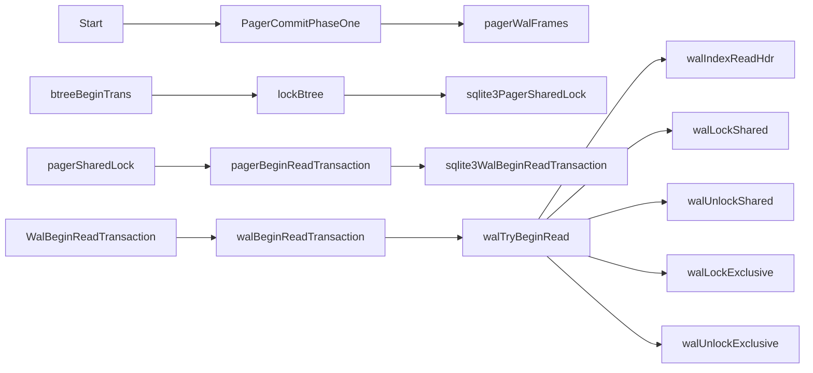
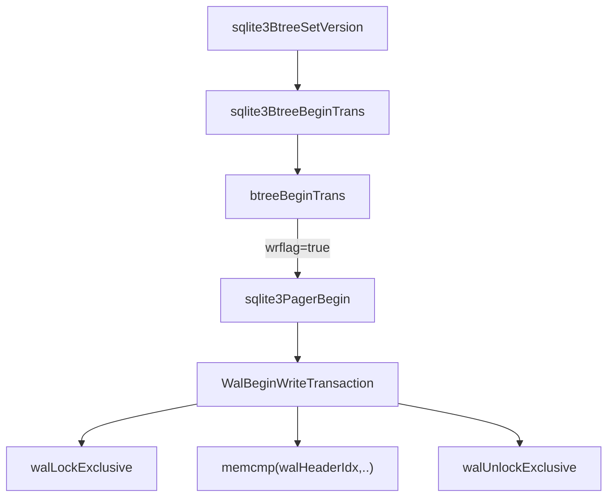
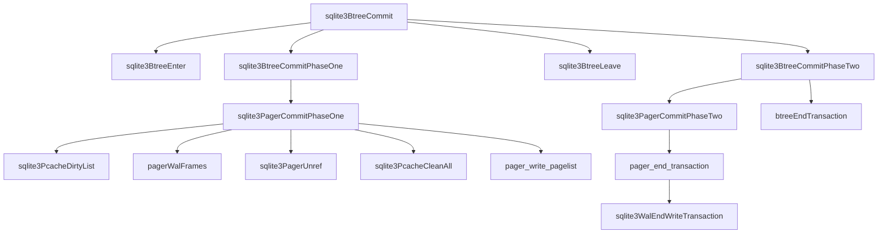

# Transaction Commit

``` 
Transaction Management
    Normal processing
        Read operation
        Write operation
        Cache flush
        Commit operation -> we're here
        Statement operations 
        Setting up savepoints
        Releasing savepoints
```

we take into account only the single database file in WAL scenario.
In WAL mode, we still need to differentiate between write and read transactions because WAL allows for multiple readers and only one writer concurrently.

Steps
1. tree module is ready to commit a transaction
2. it calls `sqlite3PagerCommitPhaseOne` function first
3. then `sqlite3PagerCommitPhaseTwo` function

Committing read txn
- releasing shared lock from db file
- returns NO_LOCK state
- does not purge page cache

Committing write txn
- pager obtains `EXCLUSIVE` lock on db file
  - if lock acquisition fails -> returns SQLITE_BUSY to the caller of the `sqlite3PagerCommitPhaseOne` function.
  - pager increases db file `metadata file-change-counter`.
  - pager writes all modified (in-cached) pages back to db file by using `cache flush` procedure.
- `flush-database-at-commit` pager calls `fsync` on db file to flush file and OS cache to disk.
- pager finalizes journal file
- pager releases EXCLUSIVE lock from db file.

Calling flow read txn


pagerWalFrames
- wrapper around sqlite3WalFrames()
- logging contents of list of pages headed by pList (connected by `pDirty`)
- this func notifies active backup processes that pages have changed.

`static int pagerBeginReadTransaction(Pager *pPager)`
- begin a read txn on WAL
- used to be called `pagerOpenSnapshot()` because it essentially makes a snapshot
of the db at current point in time and preserves that snapshot for use by reader
in spite of concurrently changes by writers or checkpointers.

`int sqlite3WalBeginReadTransaction(Wal *pWal, int *pChanged)`
- begin a read txn on db
- used to be called sqlite3OpenSnapshot()
  - it takes a snapshot of the state of the WAL and wal-index for the current instant in time.
  - current thread will continue to use this snapshot.
  - other threads might append new content to the WAL and wal-index but that extra content is ignored by current thread.
- if db contents have changes since previous read txn -> `*pChanged` is set to 1 before returning.
- Pager layer will use this to know that its cache is stale and needs to be flushed.

`static int walBeginReadTransaction(Wal *pWal, int *pChanged)`
- does the work of sqlite3WalBeginReadTransaction()

`static int walTryBeginRead(Wal *pWal, int *pChanged, int useWal, int cnt)`
- attempt to start a read txn.
- return code
  - might fail due to a race or other transient condition. When that happens, it returns `WAL_RETRY` to indicate to the caller that it is safe to retry immediately.
  - On success return SQLITE_OK.
  - On a permanent failure (such an I/O error or an SQLITE_BUSY because another process is running recovery) return a positive error code.

Calling flow write txn


Calling flow commit txn


WAL_RETRY
- the value that walTryBeginRead returns when it needs to be retried.
- this status is returned
  1. if SQLITE_BUSY is returned when taking WAL_READ_LOCK by `walLockShared(pWal, WAL_READ_LOCK(0))`.
  2. Some writers has wrapped the WAL while we are not looking. Return WAL_RETRY which will cause in-memory WAL-index to be rebuilt.
  3. If nTruncate is non-zero, then a complete transaction has been appended to this wal file. Set rc to WAL_RETRY and break out of the loop. 
  4. When frames may have been appended to the log before READ_LOCK(0) was obtained.
     1. not safe to allow reader to continue
     2. reader ignores entire log file (db file contains a trustworthy snapshot)
     3. Since holding READ_LOCK(0) prevents a checkpoint from happening, this is usually correct.
     4. However, if frames have been appended to the log (or if the log is wrapped and written for that matter) before the READ_LOCK(0) is obtained, that is not necessarily true.
     5. A checkpointer may have started to backfill the appended frames but crashed before it finished. Leaving a corrupt image in the database file.


```c 
int sqlite3PagerCommitPhaseOne(
  Pager *pPager,                  /* Pager object */
  const char *zSuper,             /* If not NULL, the super-journal name */
  int noSync                      /* True to omit the xSync on the db file */
){
    if( pagerUseWal(pPager) ){
      PgHdr *pPageOne = 0;
      pList = sqlite3PcacheDirtyList(pPager->pPCache);
      if( pList==0 ){
        /* Must have at least one page for the WAL commit flag.*/
        rc = sqlite3PagerGet(pPager, 1, &pPageOne, 0);
        pList = pPageOne;
        pList->pDirty = 0;
      }
      assert( rc==SQLITE_OK );
      if( ALWAYS(pList) ){
        rc = pagerWalFrames(pPager, pList, pPager->dbSize, 1);
      }
      sqlite3PagerUnref(pPageOne);
      if( rc==SQLITE_OK ){
        sqlite3PcacheCleanAll(pPager->pPCache);
      }
    }
}
```