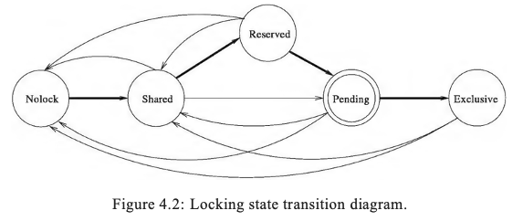

# Chapter Transaction Management


<!-- vscode-markdown-toc -->
* 1. [Transaction in SQLite](#TransactioninSQLite)
	* 1.1. [Implement a transaction](#Implementatransaction)
	* 1.2. [Opcode Transaction](#OpcodeTransaction)
	* 1.3. [Related code](#Relatedcode)
	* 1.4. [Read transaction in WAL](#ReadtransactioninWAL)
	* 1.5. [Write transaction in WAL](#WritetransactioninWAL)
* 2. [Refs](#Refs)

<!-- vscode-markdown-toc-config
	numbering=true
	autoSave=true
	/vscode-markdown-toc-config -->
<!-- /vscode-markdown-toc -->

Contents
1. how SQLite achieves ACID (Atomicity, Consistency, Isolation, Durability)
2. how SQLite uses locking
3. how transaction manager (concurrency manager) `Pager` is implemented
4. how recovery is implemented

why?
- With atomic commit, it is as if many different writes to different sections of the database file occur instantaneously and simultaneously. Real hardware serializes writes to mass storage, and writing a single sector takes a finite amount of time. So it is impossible to truly write many different sectors of a database file simultaneously and/or instantaneously.
- the atomic commit logic within SQLite makes it appear as if the changes for a transaction are all written instantaneously and simultaneously.


##  1. <a name='TransactioninSQLite'></a>Transaction in SQLite

```sql
-- example of 2 transactions in sqlite
begin;
create table test1(a int, b text);
insert into test1(a,b) values(1,'a');
insert into test1(a,b) values(2,'b');
insert into test1(a,b) values(3,'c');
update test1 set b = 'x' where a=2;
delete from test1 where a=3;
commit;

begin;
insert into test1(a,b)values(4,'d');
rollback;
```

- default mode autocommit
  - read-txn to execute select stmt
  - write-txn to execute non-select (insert, update, delete, etc.)
  - txn is committed or aborted end of stmt
  - overriden by apps by `begin` commands -> `user transaction`
- sqlite supports savepoints in user txn
  - txn can setup multiple savepoints
  - can revert back to db state to any of savepoints
  - and continue execute from there
- in a user txn, update stmts are executed in `sub-txn` one after another sequentially.
- sqlite concurrency control mechanism: `lock-based` -> `serializable`
  - database-level locking, no finer-grained locks.
  - 5 lock types implemented using `native read write locks` in different bytes of db file.
    - NOLOCK
    - SHARED
    - RESERVED
    - PENDING
    - EXCLUSIVE
  - user txn does not hold lock on db until the need arises.
- 2 types of begins
  - `begin exclusive` -> exclusive lock on all dbs (main and attached)
  - `begin immediate` -> reserved lock
- sqlite implements recovery by journal based logging and undo.




###  1.1. <a name='Implementatransaction'></a>Implement a transaction

Pager (transaction manager)
- Pager is transaction manager in sqlite, ensures ACID
- manages locks on db files + log records in journal files.
- decides on mode of locks and time of acquiring and releasing locks.
- follows strict two phase locking protocol to produce serializable transactions' execution.
- determines content of log records, writes them to journal file.


Write path
1. write log record containing recovery info (e.g. old and new values of items) to transaction log/ journal.
2. DBMS persists log record to disk before changing item in db.
3. when transaction aborted or there is a crash, db uses persisted log to move db to a consistent state.
   - either rollback/ undo operations of uncommitted transactions
   - or roll-forward/ redo operations of committed transactions that has not been reflected in db files

Commit protocol
- default is `flush-log-at-commit` + `flush-database-at-commit`

###  1.2. <a name='OpcodeTransaction'></a>Opcode Transaction

`Transaction`: Begin a transaction on database P1 if a transaction is not already active. 

P1 
- is the index of the database file on which the transaction is started. 
- =0 -> main database file
- =1 -> file used for temporary tables. 
- `>=2` -> attached databases.

P2
- If P2 is zero, then a read-transaction is started. 
- If P2 is non-zero, then a write-transaction is started, or if a read-transaction is already active, it is upgraded to a write-transaction. 
  - If P2 is 2 or more then an exclusive transaction is started.

P3, P4, P5
- for transaction cookie feature. not as important as P1 and P2.
- P5 # 0 -> checks schema cookie against `P3` and schema gen counter against `P4`. 


```bash
sqlite> explain begin immediate;
addr  opcode         p1    p2    p3    p4             p5  comment
----  -------------  ----  ----  ----  -------------  --  -------------
0     Init           0     5     0                    0   Start at 5
1     Transaction    0     1     0                    0
2     Transaction    1     1     0                    0
3     AutoCommit     0     0     0                    0
4     Halt           0     0     0                    0
5     Goto           0     1     0                    0
```

###  1.3. <a name='Relatedcode'></a>Related code

```c
// pager.h
// manage transactions
void sqlite3PagerPagecount(Pager*, int*);

// Begin a write-transaction on this pager object.
int sqlite3PagerBegin(Pager*, int exFlag, int);
// Pager.begin_read_tx()
// Pager.begin_write_tx()

// Sync db file of the pager.
int sqlite3PagerCommitPhaseOne(Pager*,const char *zSuper, int);
int sqlite3PagerSync(Pager *pPager, const char *zSuper);
// Finalize journal file so it cannot be used for hot-journal rollback.
int sqlite3PagerCommitPhaseTwo(Pager*);
int sqlite3PagerRollback(Pager*);

int sqlite3PagerExclusiveLock(Pager*);
// Obtain shared lock on db file.
int sqlite3PagerSharedLock(Pager *pPager);

// pager.h savepoints
int sqlite3PagerOpenSavepoint(Pager *pPager, int n);
int sqlite3PagerSavepoint(Pager *pPager, int op, int iSavepoint);

// wal.h
/* Used by readers to open (lock) and close (unlock) a snapshot.  A 
** snapshot is like a read-transaction.  It is the state of the database
** at an instant in time.  sqlite3WalOpenSnapshot gets a read lock and
** preserves the current state even if the other threads or processes
** write to or checkpoint the WAL.  sqlite3WalCloseSnapshot() closes the
** transaction and releases the lock. */
int sqlite3WalBeginReadTransaction(Wal *pWal, int *);
void sqlite3WalEndReadTransaction(Wal *pWal);
/* Obtain or release the WRITER lock. */
int sqlite3WalBeginWriteTransaction(Wal *pWal);
int sqlite3WalEndWriteTransaction(Wal *pWal);
```

###  1.4. <a name='ReadtransactioninWAL'></a>Read transaction in WAL

```c
// pager.c

// Obtain shared lock on db file.
int sqlite3PagerSharedLock(Pager *pPager) {
  // ..
  if( pagerUseWal(pPager) ){
    assert( rc==SQLITE_OK );
    rc = pagerBeginReadTransaction(pPager);
  }
}

// Begin a read txn on WAL
static int pagerBeginReadTransaction(Pager *pager) {
  // If the database contents have changes since the previous read transaction, 
  // then *pChanged is set to 1 before returning.
  // Pager layer will use this to know that its cache is stale and flush is needed.
  rc = wal.sqlite3WalBeginReadTransaction(pPager->pWal, &changed);
}

// wal.c
int sqlite3WalBeginReadTransaction(Wal *pWal, int *pChanged)
```

###  1.5. <a name='WritetransactioninWAL'></a>Write transaction in WAL

Pager state: WRITER_LOCKED

IN WAL mode, `WalBeginWriteTransaction()` is called to lock the log file.
If the connection is running with locking_mode=exclusive, an attempt
is made to obtain an EXCLUSIVE lock on the database file.
* A write transaction is active.
* If the connection is open in rollback-mode, a RESERVED or greater
  lock is held on the database file.
* If the connection is open in WAL-mode, a WAL write transaction
  is open (i.e. sqlite3WalBeginWriteTransaction() has been successfully
  called).
* The dbSize, dbOrigSize and dbFileSize variables are all valid.
* The contents of the pager cache have not been modified.
* The journal file may or may not be open.
* Nothing (not even the first header) has been written to the journal.

**Start a transaction**
```c
// pager.c
// Begin a write-transaction on this pager object.
int sqlite3PagerBegin(Pager*, int exFlag, int); {
   if( pagerUseWal(pPager) ) {
      // other code for locking

      /* Grab the write lock on the log file. If successful, upgrade to
      ** PAGER_RESERVED state. Otherwise, return an error code to the caller.
      ** The busy-handler is not invoked if another connection already
      ** holds the write-lock. If possible, the upper layer will call it.
      */
      rc = sqlite3WalBeginWriteTransaction(pPager->pWal);
   }

   //...
   // change pager to WRITER_LOCKED state
   pPager->eState = PAGER_WRITER_LOCKED;
   PAGERTRACE(("TRANSACTION %d\n", PAGERID(pPager)));
   //...
}

// wal.c
// Start a write txn on the WAL.
int sqlite3WalBeginWriteTransaction(Wal *pWal){
   // Only one writer allowed at a time.  
   // Get the write lock. Return SQLITE_BUSY if unable.

   // set writeLock
   pWal->writeLock = 1;

   // If another connection has written to the database file since the
   // time the read transaction on this connection was started, then
   // the write is disallowed.
}
```

###  1.6. <a name='Writetransactioninrollback'></a>Write transaction in rollback

todo

##  2. <a name='Refs'></a>Refs
- https://reorchestrate.com/posts/sqlite-transactions/
- https://www.sqlite.org/lang_transaction.html
- Transaction bytecode https://www.sqlite.org/opcode.html
- https://www.sqlitetutor.com/transaction/
- https://www.bswanson.dev/blog/exploring-sqlite-internals
- [Book - SQLite Database System Design and Implementation-Sibsankar Haldar (2016)](https://books.google.com.vn/books?id=OEJ1CQAAQBAJ)
