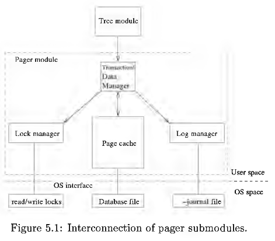

# Access Module

Access module is equivalent to SQLite Pager module.

Below is a conceptual mapping of equivalent components in SQLite to this implementation.
- Page cache -> Buffer pool
- Log manager -> Log manager
- Lock manager -> Lock manager

## What SQLite does

