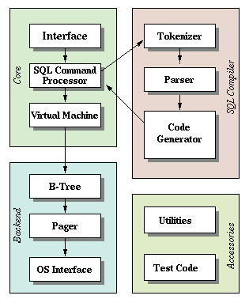

# Virtual Machine VDBE Module




The SQLite Virtual Database Engine (VDBE) is a core component of SQLite responsible for executing SQL statements. It acts as a virtual machine that interprets a set of opcodes (operations) generated from SQL statements.

From [SQLite doc](https://www.sqlite.org/opcode.html#executive_summary)
> SQLite works by translating each SQL statement into bytecode and then running that bytecode. A prepared statement in SQLite is mostly just the bytecode needed to implement the corresponding SQL. The sqlite3_prepare_v2() interface is a compiler that translates SQL into bytecode. The sqlite3_step() interface is the virtual machine that runs the bytecode contained within the prepared statement.

## Getting Started

In this section, we will explore how the SQLite Virtual Database Engine (VDBE) executes a simple SQL query using its opcodes. We will dissect the output of the `EXPLAIN` command for the query `SELECT date()`; to understand the role of each opcode in the execution process.

Starting with a sqlite process.
```bash
sqlite3
```

This command starts sqlite in a mode using a transient in-memory database without disk persistence and that's enough for us at this stage. Then we run our first command to get into the virtual machine world. 

```
sqlite> explain select date();
addr  opcode         p1    p2    p3    p4             p5  comment
----  -------------  ----  ----  ----  -------------  --  -------------
0     Init           0     6     0                    0   Start at 6
1     Once           0     3     0                    0
2     Function       0     0     2     date(-1)       0   r[2]=func()
3     Copy           2     1     0                    0   r[1]=r[2]
4     ResultRow      1     1     0                    0   output=r[1]
5     Halt           0     0     0                    0
6     Goto           0     1     0                    0
```

This query returns the current system date. The VDBE translates this SQL statement into a series of opcodes, each representing a specific operation in the execution process.

Opcode Breakdown
1. Init (0, 6, 0)
    - Purpose: Initializes the VDBE program.
    - Operation: Sets the program counter to the address specified by P2 (6 in this case), effectively skipping over the initialization opcodes to start execution at the main logic.
    - Comment: `Start at 6` indicates the starting point for execution after initialization.

2. Once (0, 3, 0)
    - Purpose: Ensures that the following block of code is executed only once.
    - Operation: If the condition is met (i.e., the block has not been executed before), it proceeds to the next opcode. Otherwise, it jumps to the address specified by P2 (3).

3. Function (0, 0, 2, date(-1))
    - Purpose: Executes a SQL function.
    - Operation: Calls the `date()` function and stores the result in register 2.
    - Comment: `r[2]=func()` indicates that the result of the function is stored in register 2.

4. Copy (2, 1, 0)
    - Purpose: Copies the content of one register to another.
    - Operation: Copies the value from register 2 to register 1.
    - Comment: `r[1]=r[2]` shows the transfer of data between registers.

5. ResultRow (1, 1, 0)
    - Purpose: Prepares the result row for output.
    - Operation: Takes the value in register 1 and prepares it as the output of the query.
    - Comment: `output=r[1]` indicates that the content of register 1 is the result of the query.

6. Halt (0, 0, 0)
    - Purpose: Stops the execution of the VDBE program.
    - Operation: Ends the execution process, signaling that the query has been fully processed.

7. Goto (0, 1, 0)
    - Purpose: Provides a mechanism for looping or jumping to a specific point in the program.
    - Operation: Jumps back to the address specified by P2 (1), effectively creating a loop if needed.

The VDBE begins execution at the `Init` opcode, which sets the starting point. The `Once` opcode ensures that the function call is executed only once. The `Function` opcode calls the `date()` function, storing the result in a register. The `Copy` opcode transfers this result to another register, which is then prepared for output by the `ResultRow` opcode. Finally, the `Halt` opcode stops the execution, completing the query processing.

## Instruction

According to the [SQLite documentation](https://www.sqlite.org/opcode.html#instruction_format)

> A bytecoded program in SQLite consists of one or more instructions. Each instruction has an opcode and five operands named P1, P2 P3, P4, and P5. The P1, P2, and P3 operands are 32-bit signed integers. These operands often refer to registers. 
> - For instructions that operate on b-tree cursors, the P1 operand is usually the cursor number. 
> - For jump instructions, P2 is usually the jump destination. 
> - P4 may be a 32-bit signed integer, a 64-bit signed integer, a 64-bit floating point value, a string literal, a Blob literal, a pointer to a collating sequence comparison function, or a pointer to the implementation of an application-defined SQL function, or various other things. 
> - P5 is a 16-bit unsigned integer normally used to hold flags. 

We will explore the registers later. For now, let's focus on the instruction first.

According to the [SQLite doc](https://www.sqlite.org/opcode.html#the_opcodes), there are currently 189 opcodes defined by the virtual machine. Hence, there are a similar number of instructions. When executing the instructions, different actions will be taken by the virtual machine depends on instruction and opcode type. In Rust, we can use an enum to represent this behavior. Enum can help us check whether we miss the execution for any bytecode. Let's represent `Instruction` by an enum in the file `src/instruction.rs`.

```rust
#[derive(Debug)]
pub enum Instruction {
   /// Halt the program
   Halt,
}
```

The first instruction to represent is [Halt](https://www.sqlite.org/opcode.html#Halt). It is important in the VM execution. The VM begins execution on instruction number 0 and stops when a Halt instruction is seen.

Then we make the program execution stop when seeing a Halt.

```rust
struct Program {}

impl Program {
   pub fn step(&self) -> Result<StepResult> {
      let insn = &self.instructions[state.pc as usize];
      match insn {
         Instruction::Halt => {
            return Ok(StepResult::Done);
         }
      }
   }
}
```